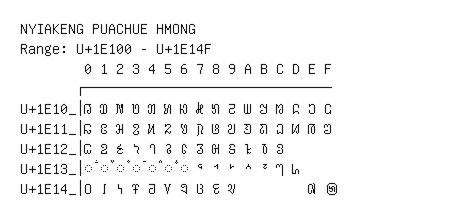

# Nyiakeng Puachue Hmong

**Range:** `U+1E100` - `U+1E14F`

[← Back to Index](../README.md)

```text
        0 1 2 3 4 5 6 7 8 9 A B C D E F
       ┌───────────────────────────────
U+1E10_│𞄀 𞄁 𞄂 𞄃 𞄄 𞄅 𞄆 𞄇 𞄈 𞄉 𞄊 𞄋 𞄌 𞄍 𞄎 𞄏
U+1E11_│𞄐 𞄑 𞄒 𞄓 𞄔 𞄕 𞄖 𞄗 𞄘 𞄙 𞄚 𞄛 𞄜 𞄝 𞄞 𞄟
U+1E12_│𞄠 𞄡 𞄢 𞄣 𞄤 𞄥 𞄦 𞄧 𞄨 𞄩 𞄪 𞄫 𞄬
U+1E13_│◌𞄰 ◌𞄱 ◌𞄲 ◌𞄳 ◌𞄴 ◌𞄵 ◌𞄶 𞄷 𞄸 𞄹 𞄺 𞄻 𞄼 𞄽
U+1E14_│𞅀 𞅁 𞅂 𞅃 𞅄 𞅅 𞅆 𞅇 𞅈 𞅉         𞅎 𞅏
```

## Visual Fallback Reference
If your system lacks the required fonts to render these characters properly, use the image below as a visual guide.


