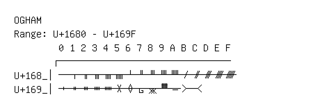

# Ogham

**Range:** `U+1680` - `U+169F`

[← Back to Index](../README.md)

```text
        0 1 2 3 4 5 6 7 8 9 A B C D E F
       ┌───────────────────────────────
U+168_│  ᚁ ᚂ ᚃ ᚄ ᚅ ᚆ ᚇ ᚈ ᚉ ᚊ ᚋ ᚌ ᚍ ᚎ ᚏ
U+169_│ᚐ ᚑ ᚒ ᚓ ᚔ ᚕ ᚖ ᚗ ᚘ ᚙ ᚚ ᚛ ᚜
```

## Visual Fallback Reference
If your system lacks the required fonts to render these characters properly, use the image below as a visual guide.


