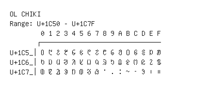

# Ol Chiki

**Range:** `U+1C50` - `U+1C7F`

[← Back to Index](../README.md)

```text
        0 1 2 3 4 5 6 7 8 9 A B C D E F
       ┌───────────────────────────────
U+1C5_│᱐ ᱑ ᱒ ᱓ ᱔ ᱕ ᱖ ᱗ ᱘ ᱙ ᱚ ᱛ ᱜ ᱝ ᱞ ᱟ
U+1C6_│ᱠ ᱡ ᱢ ᱣ ᱤ ᱥ ᱦ ᱧ ᱨ ᱩ ᱪ ᱫ ᱬ ᱭ ᱮ ᱯ
U+1C7_│ᱰ ᱱ ᱲ ᱳ ᱴ ᱵ ᱶ ᱷ ᱸ ᱹ ᱺ ᱻ ᱼ ᱽ ᱾ ᱿
```

## Visual Fallback Reference
If your system lacks the required fonts to render these characters properly, use the image below as a visual guide.


