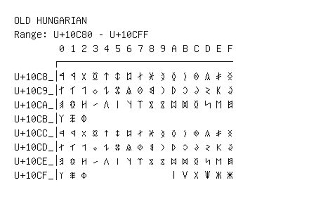

# Old Hungarian

**Range:** `U+10C80` - `U+10CFF`

[← Back to Index](../README.md)

```text
        0 1 2 3 4 5 6 7 8 9 A B C D E F
       ┌───────────────────────────────
U+10C8_│𐲀 𐲁 𐲂 𐲃 𐲄 𐲅 𐲆 𐲇 𐲈 𐲉 𐲊 𐲋 𐲌 𐲍 𐲎 𐲏
U+10C9_│𐲐 𐲑 𐲒 𐲓 𐲔 𐲕 𐲖 𐲗 𐲘 𐲙 𐲚 𐲛 𐲜 𐲝 𐲞 𐲟
U+10CA_│𐲠 𐲡 𐲢 𐲣 𐲤 𐲥 𐲦 𐲧 𐲨 𐲩 𐲪 𐲫 𐲬 𐲭 𐲮 𐲯
U+10CB_│𐲰 𐲱 𐲲
U+10CC_│𐳀 𐳁 𐳂 𐳃 𐳄 𐳅 𐳆 𐳇 𐳈 𐳉 𐳊 𐳋 𐳌 𐳍 𐳎 𐳏
U+10CD_│𐳐 𐳑 𐳒 𐳓 𐳔 𐳕 𐳖 𐳗 𐳘 𐳙 𐳚 𐳛 𐳜 𐳝 𐳞 𐳟
U+10CE_│𐳠 𐳡 𐳢 𐳣 𐳤 𐳥 𐳦 𐳧 𐳨 𐳩 𐳪 𐳫 𐳬 𐳭 𐳮 𐳯
U+10CF_│𐳰 𐳱 𐳲               𐳺 𐳻 𐳼 𐳽 𐳾 𐳿
```

## Visual Fallback Reference
If your system lacks the required fonts to render these characters properly, use the image below as a visual guide.


