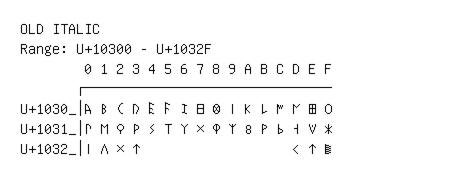

# Old Italic

**Range:** `U+10300` - `U+1032F`

[← Back to Index](../README.md)

```text
        0 1 2 3 4 5 6 7 8 9 A B C D E F
       ┌───────────────────────────────
U+1030_│𐌀 𐌁 𐌂 𐌃 𐌄 𐌅 𐌆 𐌇 𐌈 𐌉 𐌊 𐌋 𐌌 𐌍 𐌎 𐌏
U+1031_│𐌐 𐌑 𐌒 𐌓 𐌔 𐌕 𐌖 𐌗 𐌘 𐌙 𐌚 𐌛 𐌜 𐌝 𐌞 𐌟
U+1032_│𐌠 𐌡 𐌢 𐌣                   𐌭 𐌮 𐌯
```

## Visual Fallback Reference
If your system lacks the required fonts to render these characters properly, use the image below as a visual guide.


