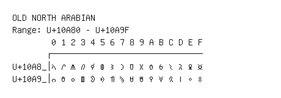

# Old North Arabian

**Range:** `U+10A80` - `U+10A9F`

[← Back to Index](../README.md)

```text
        0 1 2 3 4 5 6 7 8 9 A B C D E F
       ┌───────────────────────────────
U+10A8_│𐪀 𐪁 𐪂 𐪃 𐪄 𐪅 𐪆 𐪇 𐪈 𐪉 𐪊 𐪋 𐪌 𐪍 𐪎 𐪏
U+10A9_│𐪐 𐪑 𐪒 𐪓 𐪔 𐪕 𐪖 𐪗 𐪘 𐪙 𐪚 𐪛 𐪜 𐪝 𐪞 𐪟
```

## Visual Fallback Reference
If your system lacks the required fonts to render these characters properly, use the image below as a visual guide.


