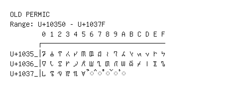

# Old Permic

**Range:** `U+10350` - `U+1037F`

[← Back to Index](../README.md)

```text
        0 1 2 3 4 5 6 7 8 9 A B C D E F
       ┌───────────────────────────────
U+1035_│𐍐 𐍑 𐍒 𐍓 𐍔 𐍕 𐍖 𐍗 𐍘 𐍙 𐍚 𐍛 𐍜 𐍝 𐍞 𐍟
U+1036_│𐍠 𐍡 𐍢 𐍣 𐍤 𐍥 𐍦 𐍧 𐍨 𐍩 𐍪 𐍫 𐍬 𐍭 𐍮 𐍯
U+1037_│𐍰 𐍱 𐍲 𐍳 𐍴 𐍵 ◌𐍶 ◌𐍷 ◌𐍸 ◌𐍹 ◌𐍺
```

## Visual Fallback Reference
If your system lacks the required fonts to render these characters properly, use the image below as a visual guide.


