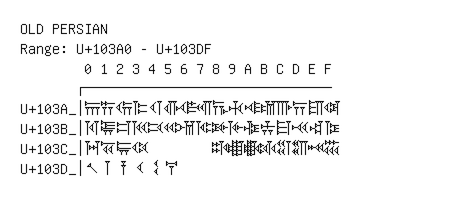

# Old Persian

**Range:** `U+103A0` - `U+103DF`

[← Back to Index](../README.md)

```text
        0 1 2 3 4 5 6 7 8 9 A B C D E F
       ┌───────────────────────────────
U+103A_│𐎠 𐎡 𐎢 𐎣 𐎤 𐎥 𐎦 𐎧 𐎨 𐎩 𐎪 𐎫 𐎬 𐎭 𐎮 𐎯
U+103B_│𐎰 𐎱 𐎲 𐎳 𐎴 𐎵 𐎶 𐎷 𐎸 𐎹 𐎺 𐎻 𐎼 𐎽 𐎾 𐎿
U+103C_│𐏀 𐏁 𐏂 𐏃         𐏈 𐏉 𐏊 𐏋 𐏌 𐏍 𐏎 𐏏
U+103D_│𐏐 𐏑 𐏒 𐏓 𐏔 𐏕
```

## Visual Fallback Reference
If your system lacks the required fonts to render these characters properly, use the image below as a visual guide.


