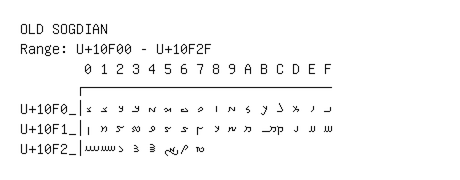

# Old Sogdian

**Range:** `U+10F00` - `U+10F2F`

[← Back to Index](../README.md)

```text
        0 1 2 3 4 5 6 7 8 9 A B C D E F
       ┌───────────────────────────────
U+10F0_│𐼀 𐼁 𐼂 𐼃 𐼄 𐼅 𐼆 𐼇 𐼈 𐼉 𐼊 𐼋 𐼌 𐼍 𐼎 𐼏
U+10F1_│𐼐 𐼑 𐼒 𐼓 𐼔 𐼕 𐼖 𐼗 𐼘 𐼙 𐼚 𐼛 𐼜 𐼝 𐼞 𐼟
U+10F2_│𐼠 𐼡 𐼢 𐼣 𐼤 𐼥 𐼦 𐼧
```

## Visual Fallback Reference
If your system lacks the required fonts to render these characters properly, use the image below as a visual guide.


