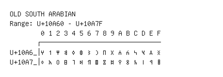

# Old South Arabian

**Range:** `U+10A60` - `U+10A7F`

[← Back to Index](../README.md)

```text
        0 1 2 3 4 5 6 7 8 9 A B C D E F
       ┌───────────────────────────────
U+10A6_│𐩠 𐩡 𐩢 𐩣 𐩤 𐩥 𐩦 𐩧 𐩨 𐩩 𐩪 𐩫 𐩬 𐩭 𐩮 𐩯
U+10A7_│𐩰 𐩱 𐩲 𐩳 𐩴 𐩵 𐩶 𐩷 𐩸 𐩹 𐩺 𐩻 𐩼 𐩽 𐩾 𐩿
```

## Visual Fallback Reference
If your system lacks the required fonts to render these characters properly, use the image below as a visual guide.


