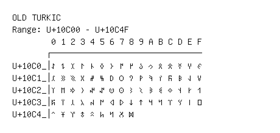

# Old Turkic

**Range:** `U+10C00` - `U+10C4F`

[← Back to Index](../README.md)

```text
        0 1 2 3 4 5 6 7 8 9 A B C D E F
       ┌───────────────────────────────
U+10C0_│𐰀 𐰁 𐰂 𐰃 𐰄 𐰅 𐰆 𐰇 𐰈 𐰉 𐰊 𐰋 𐰌 𐰍 𐰎 𐰏
U+10C1_│𐰐 𐰑 𐰒 𐰓 𐰔 𐰕 𐰖 𐰗 𐰘 𐰙 𐰚 𐰛 𐰜 𐰝 𐰞 𐰟
U+10C2_│𐰠 𐰡 𐰢 𐰣 𐰤 𐰥 𐰦 𐰧 𐰨 𐰩 𐰪 𐰫 𐰬 𐰭 𐰮 𐰯
U+10C3_│𐰰 𐰱 𐰲 𐰳 𐰴 𐰵 𐰶 𐰷 𐰸 𐰹 𐰺 𐰻 𐰼 𐰽 𐰾 𐰿
U+10C4_│𐱀 𐱁 𐱂 𐱃 𐱄 𐱅 𐱆 𐱇 𐱈
```

## Visual Fallback Reference
If your system lacks the required fonts to render these characters properly, use the image below as a visual guide.


