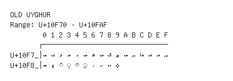

# Old Uyghur

**Range:** `U+10F70` - `U+10FAF`

[← Back to Index](../README.md)

```text
        0 1 2 3 4 5 6 7 8 9 A B C D E F
       ┌───────────────────────────────
U+10F7_│𐽰 𐽱 𐽲 𐽳 𐽴 𐽵 𐽶 𐽷 𐽸 𐽹 𐽺 𐽻 𐽼 𐽽 𐽾 𐽿
U+10F8_│𐾀 𐾁 ◌𐾂 ◌𐾃 ◌𐾄 ◌𐾅 𐾆 𐾇 𐾈 𐾉
```

## Visual Fallback Reference
If your system lacks the required fonts to render these characters properly, use the image below as a visual guide.


