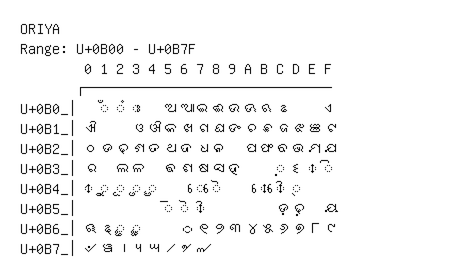

# Oriya

**Range:** `U+0B00` - `U+0B7F`

[← Back to Index](../README.md)

```text
        0 1 2 3 4 5 6 7 8 9 A B C D E F
       ┌───────────────────────────────
U+0B0_│  ◌ଁ ◌ଂ ◌ଃ   ଅ ଆ ଇ ଈ ଉ ଊ ଋ ଌ     ଏ
U+0B1_│ଐ     ଓ ଔ କ ଖ ଗ ଘ ଙ ଚ ଛ ଜ ଝ ଞ ଟ
U+0B2_│ଠ ଡ ଢ ଣ ତ ଥ ଦ ଧ ନ   ପ ଫ ବ ଭ ମ ଯ
U+0B3_│ର   ଲ ଳ   ଵ ଶ ଷ ସ ହ     ◌଼ ଽ ◌ା ◌ି
U+0B4_│◌ୀ ◌ୁ ◌ୂ ◌ୃ ◌ୄ     ◌େ ◌ୈ     ◌ୋ ◌ୌ ◌୍
U+0B5_│          ◌୕ ◌ୖ ◌ୗ         ଡ଼ ଢ଼   ୟ
U+0B6_│ୠ ୡ ◌ୢ ◌ୣ     ୦ ୧ ୨ ୩ ୪ ୫ ୬ ୭ ୮ ୯
U+0B7_│୰ ୱ ୲ ୳ ୴ ୵ ୶ ୷
```

## Visual Fallback Reference
If your system lacks the required fonts to render these characters properly, use the image below as a visual guide.


