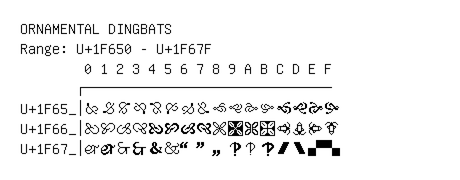

# Ornamental Dingbats

**Range:** `U+1F650` - `U+1F67F`

[← Back to Index](../README.md)

```text
        0 1 2 3 4 5 6 7 8 9 A B C D E F
       ┌───────────────────────────────
U+1F65_│🙐 🙑 🙒 🙓 🙔 🙕 🙖 🙗 🙘 🙙 🙚 🙛 🙜 🙝 🙞 🙟
U+1F66_│🙠 🙡 🙢 🙣 🙤 🙥 🙦 🙧 🙨 🙩 🙪 🙫 🙬 🙭 🙮 🙯
U+1F67_│🙰 🙱 🙲 🙳 🙴 🙵 🙶 🙷 🙸 🙹 🙺 🙻 🙼 🙽 🙾 🙿
```

## Visual Fallback Reference
If your system lacks the required fonts to render these characters properly, use the image below as a visual guide.


