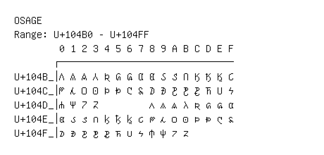

# Osage

**Range:** `U+104B0` - `U+104FF`

[← Back to Index](../README.md)

```text
        0 1 2 3 4 5 6 7 8 9 A B C D E F
       ┌───────────────────────────────
U+104B_│𐒰 𐒱 𐒲 𐒳 𐒴 𐒵 𐒶 𐒷 𐒸 𐒹 𐒺 𐒻 𐒼 𐒽 𐒾 𐒿
U+104C_│𐓀 𐓁 𐓂 𐓃 𐓄 𐓅 𐓆 𐓇 𐓈 𐓉 𐓊 𐓋 𐓌 𐓍 𐓎 𐓏
U+104D_│𐓐 𐓑 𐓒 𐓓         𐓘 𐓙 𐓚 𐓛 𐓜 𐓝 𐓞 𐓟
U+104E_│𐓠 𐓡 𐓢 𐓣 𐓤 𐓥 𐓦 𐓧 𐓨 𐓩 𐓪 𐓫 𐓬 𐓭 𐓮 𐓯
U+104F_│𐓰 𐓱 𐓲 𐓳 𐓴 𐓵 𐓶 𐓷 𐓸 𐓹 𐓺 𐓻
```

## Visual Fallback Reference
If your system lacks the required fonts to render these characters properly, use the image below as a visual guide.


