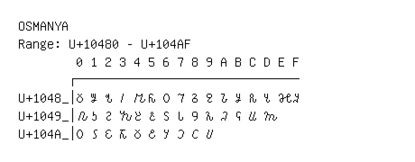

# Osmanya

**Range:** `U+10480` - `U+104AF`

[← Back to Index](../README.md)

```text
        0 1 2 3 4 5 6 7 8 9 A B C D E F
       ┌───────────────────────────────
U+1048_│𐒀 𐒁 𐒂 𐒃 𐒄 𐒅 𐒆 𐒇 𐒈 𐒉 𐒊 𐒋 𐒌 𐒍 𐒎 𐒏
U+1049_│𐒐 𐒑 𐒒 𐒓 𐒔 𐒕 𐒖 𐒗 𐒘 𐒙 𐒚 𐒛 𐒜 𐒝
U+104A_│𐒠 𐒡 𐒢 𐒣 𐒤 𐒥 𐒦 𐒧 𐒨 𐒩
```

## Visual Fallback Reference
If your system lacks the required fonts to render these characters properly, use the image below as a visual guide.


