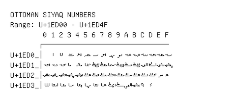

# Ottoman Siyaq Numbers

**Range:** `U+1ED00` - `U+1ED4F`

[← Back to Index](../README.md)

```text
        0 1 2 3 4 5 6 7 8 9 A B C D E F
       ┌───────────────────────────────
U+1ED0_│  𞴁 𞴂 𞴃 𞴄 𞴅 𞴆 𞴇 𞴈 𞴉 𞴊 𞴋 𞴌 𞴍 𞴎 𞴏
U+1ED1_│𞴐 𞴑 𞴒 𞴓 𞴔 𞴕 𞴖 𞴗 𞴘 𞴙 𞴚 𞴛 𞴜 𞴝 𞴞 𞴟
U+1ED2_│𞴠 𞴡 𞴢 𞴣 𞴤 𞴥 𞴦 𞴧 𞴨 𞴩 𞴪 𞴫 𞴬 𞴭 𞴮 𞴯
U+1ED3_│𞴰 𞴱 𞴲 𞴳 𞴴 𞴵 𞴶 𞴷 𞴸 𞴹 𞴺 𞴻 𞴼 𞴽
```

## Visual Fallback Reference
If your system lacks the required fonts to render these characters properly, use the image below as a visual guide.


