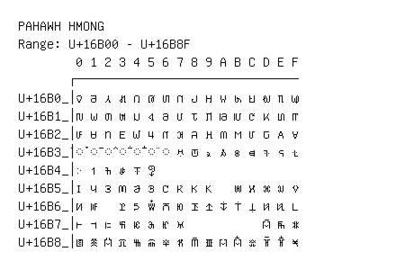

# Pahawh Hmong

**Range:** `U+16B00` - `U+16B8F`

[← Back to Index](../README.md)

```text
        0 1 2 3 4 5 6 7 8 9 A B C D E F
       ┌───────────────────────────────
U+16B0_│𖬀 𖬁 𖬂 𖬃 𖬄 𖬅 𖬆 𖬇 𖬈 𖬉 𖬊 𖬋 𖬌 𖬍 𖬎 𖬏
U+16B1_│𖬐 𖬑 𖬒 𖬓 𖬔 𖬕 𖬖 𖬗 𖬘 𖬙 𖬚 𖬛 𖬜 𖬝 𖬞 𖬟
U+16B2_│𖬠 𖬡 𖬢 𖬣 𖬤 𖬥 𖬦 𖬧 𖬨 𖬩 𖬪 𖬫 𖬬 𖬭 𖬮 𖬯
U+16B3_│◌𖬰 ◌𖬱 ◌𖬲 ◌𖬳 ◌𖬴 ◌𖬵 ◌𖬶 𖬷 𖬸 𖬹 𖬺 𖬻 𖬼 𖬽 𖬾 𖬿
U+16B4_│𖭀 𖭁 𖭂 𖭃 𖭄 𖭅
U+16B5_│𖭐 𖭑 𖭒 𖭓 𖭔 𖭕 𖭖 𖭗 𖭘 𖭙   𖭛 𖭜 𖭝 𖭞 𖭟
U+16B6_│𖭠 𖭡   𖭣 𖭤 𖭥 𖭦 𖭧 𖭨 𖭩 𖭪 𖭫 𖭬 𖭭 𖭮 𖭯
U+16B7_│𖭰 𖭱 𖭲 𖭳 𖭴 𖭵 𖭶 𖭷           𖭽 𖭾 𖭿
U+16B8_│𖮀 𖮁 𖮂 𖮃 𖮄 𖮅 𖮆 𖮇 𖮈 𖮉 𖮊 𖮋 𖮌 𖮍 𖮎 𖮏
```

## Visual Fallback Reference
If your system lacks the required fonts to render these characters properly, use the image below as a visual guide.


