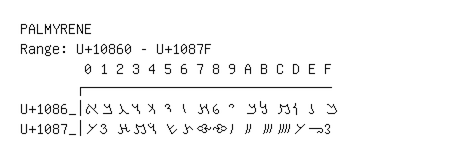

# Palmyrene

**Range:** `U+10860` - `U+1087F`

[← Back to Index](../README.md)

```text
        0 1 2 3 4 5 6 7 8 9 A B C D E F
       ┌───────────────────────────────
U+1086_│𐡠 𐡡 𐡢 𐡣 𐡤 𐡥 𐡦 𐡧 𐡨 𐡩 𐡪 𐡫 𐡬 𐡭 𐡮 𐡯
U+1087_│𐡰 𐡱 𐡲 𐡳 𐡴 𐡵 𐡶 𐡷 𐡸 𐡹 𐡺 𐡻 𐡼 𐡽 𐡾 𐡿
```

## Visual Fallback Reference
If your system lacks the required fonts to render these characters properly, use the image below as a visual guide.


