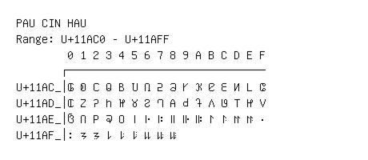

# Pau Cin Hau

**Range:** `U+11AC0` - `U+11AFF`

[← Back to Index](../README.md)

```text
        0 1 2 3 4 5 6 7 8 9 A B C D E F
       ┌───────────────────────────────
U+11AC_│𑫀 𑫁 𑫂 𑫃 𑫄 𑫅 𑫆 𑫇 𑫈 𑫉 𑫊 𑫋 𑫌 𑫍 𑫎 𑫏
U+11AD_│𑫐 𑫑 𑫒 𑫓 𑫔 𑫕 𑫖 𑫗 𑫘 𑫙 𑫚 𑫛 𑫜 𑫝 𑫞 𑫟
U+11AE_│𑫠 𑫡 𑫢 𑫣 𑫤 𑫥 𑫦 𑫧 𑫨 𑫩 𑫪 𑫫 𑫬 𑫭 𑫮 𑫯
U+11AF_│𑫰 𑫱 𑫲 𑫳 𑫴 𑫵 𑫶 𑫷 𑫸
```

## Visual Fallback Reference
If your system lacks the required fonts to render these characters properly, use the image below as a visual guide.


