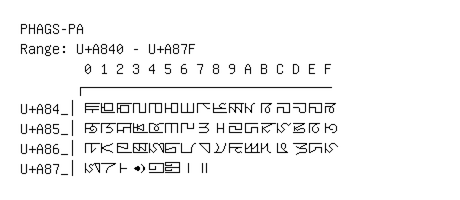

# Phags-pa

**Range:** `U+A840` - `U+A87F`

[← Back to Index](../README.md)

```text
        0 1 2 3 4 5 6 7 8 9 A B C D E F
       ┌───────────────────────────────
U+A84_│ꡀ ꡁ ꡂ ꡃ ꡄ ꡅ ꡆ ꡇ ꡈ ꡉ ꡊ ꡋ ꡌ ꡍ ꡎ ꡏ
U+A85_│ꡐ ꡑ ꡒ ꡓ ꡔ ꡕ ꡖ ꡗ ꡘ ꡙ ꡚ ꡛ ꡜ ꡝ ꡞ ꡟ
U+A86_│ꡠ ꡡ ꡢ ꡣ ꡤ ꡥ ꡦ ꡧ ꡨ ꡩ ꡪ ꡫ ꡬ ꡭ ꡮ ꡯ
U+A87_│ꡰ ꡱ ꡲ ꡳ ꡴ ꡵ ꡶ ꡷
```

## Visual Fallback Reference
If your system lacks the required fonts to render these characters properly, use the image below as a visual guide.


