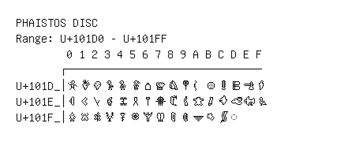

# Phaistos Disc

**Range:** `U+101D0` - `U+101FF`

[← Back to Index](../README.md)

```text
        0 1 2 3 4 5 6 7 8 9 A B C D E F
       ┌───────────────────────────────
U+101D_│𐇐 𐇑 𐇒 𐇓 𐇔 𐇕 𐇖 𐇗 𐇘 𐇙 𐇚 𐇛 𐇜 𐇝 𐇞 𐇟
U+101E_│𐇠 𐇡 𐇢 𐇣 𐇤 𐇥 𐇦 𐇧 𐇨 𐇩 𐇪 𐇫 𐇬 𐇭 𐇮 𐇯
U+101F_│𐇰 𐇱 𐇲 𐇳 𐇴 𐇵 𐇶 𐇷 𐇸 𐇹 𐇺 𐇻 𐇼 ◌𐇽
```

## Visual Fallback Reference
If your system lacks the required fonts to render these characters properly, use the image below as a visual guide.


