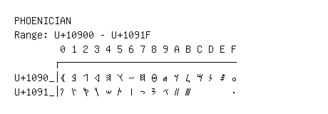

# Phoenician

**Range:** `U+10900` - `U+1091F`

[← Back to Index](../README.md)

```text
        0 1 2 3 4 5 6 7 8 9 A B C D E F
       ┌───────────────────────────────
U+1090_│𐤀 𐤁 𐤂 𐤃 𐤄 𐤅 𐤆 𐤇 𐤈 𐤉 𐤊 𐤋 𐤌 𐤍 𐤎 𐤏
U+1091_│𐤐 𐤑 𐤒 𐤓 𐤔 𐤕 𐤖 𐤗 𐤘 𐤙 𐤚 𐤛       𐤟
```

## Visual Fallback Reference
If your system lacks the required fonts to render these characters properly, use the image below as a visual guide.


