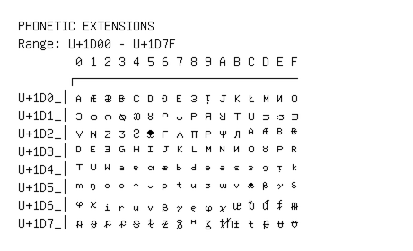

# Phonetic Extensions

**Range:** `U+1D00` - `U+1D7F`

[← Back to Index](../README.md)

```text
        0 1 2 3 4 5 6 7 8 9 A B C D E F
       ┌───────────────────────────────
U+1D0_│ᴀ ᴁ ᴂ ᴃ ᴄ ᴅ ᴆ ᴇ ᴈ ᴉ ᴊ ᴋ ᴌ ᴍ ᴎ ᴏ
U+1D1_│ᴐ ᴑ ᴒ ᴓ ᴔ ᴕ ᴖ ᴗ ᴘ ᴙ ᴚ ᴛ ᴜ ᴝ ᴞ ᴟ
U+1D2_│ᴠ ᴡ ᴢ ᴣ ᴤ ᴥ ᴦ ᴧ ᴨ ᴩ ᴪ ᴫ ᴬ ᴭ ᴮ ᴯ
U+1D3_│ᴰ ᴱ ᴲ ᴳ ᴴ ᴵ ᴶ ᴷ ᴸ ᴹ ᴺ ᴻ ᴼ ᴽ ᴾ ᴿ
U+1D4_│ᵀ ᵁ ᵂ ᵃ ᵄ ᵅ ᵆ ᵇ ᵈ ᵉ ᵊ ᵋ ᵌ ᵍ ᵎ ᵏ
U+1D5_│ᵐ ᵑ ᵒ ᵓ ᵔ ᵕ ᵖ ᵗ ᵘ ᵙ ᵚ ᵛ ᵜ ᵝ ᵞ ᵟ
U+1D6_│ᵠ ᵡ ᵢ ᵣ ᵤ ᵥ ᵦ ᵧ ᵨ ᵩ ᵪ ᵫ ᵬ ᵭ ᵮ ᵯ
U+1D7_│ᵰ ᵱ ᵲ ᵳ ᵴ ᵵ ᵶ ᵷ ᵸ ᵹ ᵺ ᵻ ᵼ ᵽ ᵾ ᵿ
```

## Visual Fallback Reference
If your system lacks the required fonts to render these characters properly, use the image below as a visual guide.


