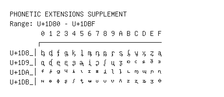

# Phonetic Extensions Supplement

**Range:** `U+1D80` - `U+1DBF`

[← Back to Index](../README.md)

```text
        0 1 2 3 4 5 6 7 8 9 A B C D E F
       ┌───────────────────────────────
U+1D8_│ᶀ ᶁ ᶂ ᶃ ᶄ ᶅ ᶆ ᶇ ᶈ ᶉ ᶊ ᶋ ᶌ ᶍ ᶎ ᶏ
U+1D9_│ᶐ ᶑ ᶒ ᶓ ᶔ ᶕ ᶖ ᶗ ᶘ ᶙ ᶚ ᶛ ᶜ ᶝ ᶞ ᶟ
U+1DA_│ᶠ ᶡ ᶢ ᶣ ᶤ ᶥ ᶦ ᶧ ᶨ ᶩ ᶪ ᶫ ᶬ ᶭ ᶮ ᶯ
U+1DB_│ᶰ ᶱ ᶲ ᶳ ᶴ ᶵ ᶶ ᶷ ᶸ ᶹ ᶺ ᶻ ᶼ ᶽ ᶾ ᶿ
```

## Visual Fallback Reference
If your system lacks the required fonts to render these characters properly, use the image below as a visual guide.


