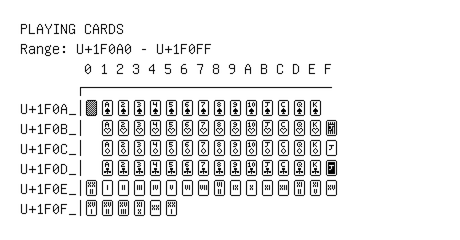

# Playing Cards

**Range:** `U+1F0A0` - `U+1F0FF`

[← Back to Index](../README.md)

```text
        0 1 2 3 4 5 6 7 8 9 A B C D E F
       ┌───────────────────────────────
U+1F0A_│🂠 🂡 🂢 🂣 🂤 🂥 🂦 🂧 🂨 🂩 🂪 🂫 🂬 🂭 🂮
U+1F0B_│  🂱 🂲 🂳 🂴 🂵 🂶 🂷 🂸 🂹 🂺 🂻 🂼 🂽 🂾 🂿
U+1F0C_│  🃁 🃂 🃃 🃄 🃅 🃆 🃇 🃈 🃉 🃊 🃋 🃌 🃍 🃎 🃏
U+1F0D_│  🃑 🃒 🃓 🃔 🃕 🃖 🃗 🃘 🃙 🃚 🃛 🃜 🃝 🃞 🃟
U+1F0E_│🃠 🃡 🃢 🃣 🃤 🃥 🃦 🃧 🃨 🃩 🃪 🃫 🃬 🃭 🃮 🃯
U+1F0F_│🃰 🃱 🃲 🃳 🃴 🃵
```

## Visual Fallback Reference
If your system lacks the required fonts to render these characters properly, use the image below as a visual guide.


