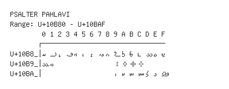

# Psalter Pahlavi

**Range:** `U+10B80` - `U+10BAF`

[← Back to Index](../README.md)

```text
        0 1 2 3 4 5 6 7 8 9 A B C D E F
       ┌───────────────────────────────
U+10B8_│𐮀 𐮁 𐮂 𐮃 𐮄 𐮅 𐮆 𐮇 𐮈 𐮉 𐮊 𐮋 𐮌 𐮍 𐮎 𐮏
U+10B9_│𐮐 𐮑               𐮙 𐮚 𐮛 𐮜
U+10BA_│                  𐮩 𐮪 𐮫 𐮬 𐮭 𐮮 𐮯
```

## Visual Fallback Reference
If your system lacks the required fonts to render these characters properly, use the image below as a visual guide.


