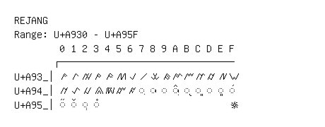

# Rejang

**Range:** `U+A930` - `U+A95F`

[← Back to Index](../README.md)

```text
        0 1 2 3 4 5 6 7 8 9 A B C D E F
       ┌───────────────────────────────
U+A93_│ꤰ ꤱ ꤲ ꤳ ꤴ ꤵ ꤶ ꤷ ꤸ ꤹ ꤺ ꤻ ꤼ ꤽ ꤾ ꤿ
U+A94_│ꥀ ꥁ ꥂ ꥃ ꥄ ꥅ ꥆ ◌ꥇ ◌ꥈ ◌ꥉ ◌ꥊ ◌ꥋ ◌ꥌ ◌ꥍ ◌ꥎ ◌ꥏ
U+A95_│◌ꥐ ◌ꥑ ◌ꥒ ◌꥓                       ꥟
```

## Visual Fallback Reference
If your system lacks the required fonts to render these characters properly, use the image below as a visual guide.


