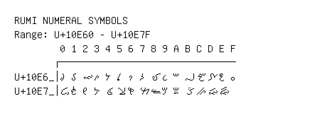

# Rumi Numeral Symbols

**Range:** `U+10E60` - `U+10E7F`

[← Back to Index](../README.md)

```text
        0 1 2 3 4 5 6 7 8 9 A B C D E F
       ┌───────────────────────────────
U+10E6_│𐹠 𐹡 𐹢 𐹣 𐹤 𐹥 𐹦 𐹧 𐹨 𐹩 𐹪 𐹫 𐹬 𐹭 𐹮 𐹯
U+10E7_│𐹰 𐹱 𐹲 𐹳 𐹴 𐹵 𐹶 𐹷 𐹸 𐹹 𐹺 𐹻 𐹼 𐹽 𐹾
```

## Visual Fallback Reference
If your system lacks the required fonts to render these characters properly, use the image below as a visual guide.


