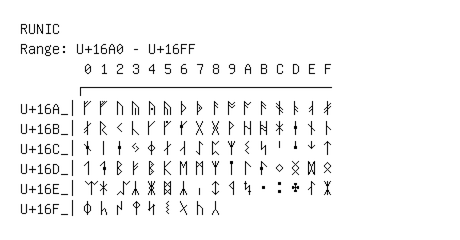

# Runic

**Range:** `U+16A0` - `U+16FF`

[← Back to Index](../README.md)

```text
        0 1 2 3 4 5 6 7 8 9 A B C D E F
       ┌───────────────────────────────
U+16A_│ᚠ ᚡ ᚢ ᚣ ᚤ ᚥ ᚦ ᚧ ᚨ ᚩ ᚪ ᚫ ᚬ ᚭ ᚮ ᚯ
U+16B_│ᚰ ᚱ ᚲ ᚳ ᚴ ᚵ ᚶ ᚷ ᚸ ᚹ ᚺ ᚻ ᚼ ᚽ ᚾ ᚿ
U+16C_│ᛀ ᛁ ᛂ ᛃ ᛄ ᛅ ᛆ ᛇ ᛈ ᛉ ᛊ ᛋ ᛌ ᛍ ᛎ ᛏ
U+16D_│ᛐ ᛑ ᛒ ᛓ ᛔ ᛕ ᛖ ᛗ ᛘ ᛙ ᛚ ᛛ ᛜ ᛝ ᛞ ᛟ
U+16E_│ᛠ ᛡ ᛢ ᛣ ᛤ ᛥ ᛦ ᛧ ᛨ ᛩ ᛪ ᛫ ᛬ ᛭ ᛮ ᛯ
U+16F_│ᛰ ᛱ ᛲ ᛳ ᛴ ᛵ ᛶ ᛷ ᛸ
```

## Visual Fallback Reference
If your system lacks the required fonts to render these characters properly, use the image below as a visual guide.


