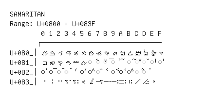

# Samaritan

**Range:** `U+0800` - `U+083F`

[← Back to Index](../README.md)

```text
        0 1 2 3 4 5 6 7 8 9 A B C D E F
       ┌───────────────────────────────
U+080_│ࠀ ࠁ ࠂ ࠃ ࠄ ࠅ ࠆ ࠇ ࠈ ࠉ ࠊ ࠋ ࠌ ࠍ ࠎ ࠏ
U+081_│ࠐ ࠑ ࠒ ࠓ ࠔ ࠕ ◌ࠖ ◌ࠗ ◌࠘ ◌࠙ ࠚ ◌ࠛ ◌ࠜ ◌ࠝ ◌ࠞ ◌ࠟ
U+082_│◌ࠠ ◌ࠡ ◌ࠢ ◌ࠣ ࠤ ◌ࠥ ◌ࠦ ◌ࠧ ࠨ ◌ࠩ ◌ࠪ ◌ࠫ ◌ࠬ ◌࠭
U+083_│࠰ ࠱ ࠲ ࠳ ࠴ ࠵ ࠶ ࠷ ࠸ ࠹ ࠺ ࠻ ࠼ ࠽ ࠾
```

## Visual Fallback Reference
If your system lacks the required fonts to render these characters properly, use the image below as a visual guide.


