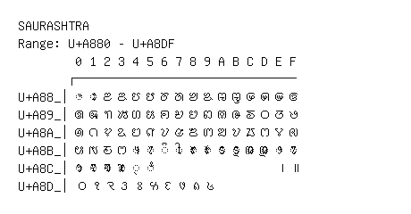

# Saurashtra

**Range:** `U+A880` - `U+A8DF`

[← Back to Index](../README.md)

```text
        0 1 2 3 4 5 6 7 8 9 A B C D E F
       ┌───────────────────────────────
U+A88_│◌ꢀ ◌ꢁ ꢂ ꢃ ꢄ ꢅ ꢆ ꢇ ꢈ ꢉ ꢊ ꢋ ꢌ ꢍ ꢎ ꢏ
U+A89_│ꢐ ꢑ ꢒ ꢓ ꢔ ꢕ ꢖ ꢗ ꢘ ꢙ ꢚ ꢛ ꢜ ꢝ ꢞ ꢟ
U+A8A_│ꢠ ꢡ ꢢ ꢣ ꢤ ꢥ ꢦ ꢧ ꢨ ꢩ ꢪ ꢫ ꢬ ꢭ ꢮ ꢯ
U+A8B_│ꢰ ꢱ ꢲ ꢳ ◌ꢴ ◌ꢵ ◌ꢶ ◌ꢷ ◌ꢸ ◌ꢹ ◌ꢺ ◌ꢻ ◌ꢼ ◌ꢽ ◌ꢾ ◌ꢿ
U+A8C_│◌ꣀ ◌ꣁ ◌ꣂ ◌ꣃ ◌꣄ ◌ꣅ                 ꣎ ꣏
U+A8D_│꣐ ꣑ ꣒ ꣓ ꣔ ꣕ ꣖ ꣗ ꣘ ꣙
```

## Visual Fallback Reference
If your system lacks the required fonts to render these characters properly, use the image below as a visual guide.


