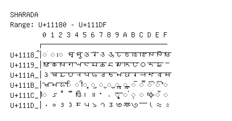

# Sharada

**Range:** `U+11180` - `U+111DF`

[← Back to Index](../README.md)

```text
        0 1 2 3 4 5 6 7 8 9 A B C D E F
       ┌───────────────────────────────
U+1118_│◌𑆀 ◌𑆁 ◌𑆂 𑆃 𑆄 𑆅 𑆆 𑆇 𑆈 𑆉 𑆊 𑆋 𑆌 𑆍 𑆎 𑆏
U+1119_│𑆐 𑆑 𑆒 𑆓 𑆔 𑆕 𑆖 𑆗 𑆘 𑆙 𑆚 𑆛 𑆜 𑆝 𑆞 𑆟
U+111A_│𑆠 𑆡 𑆢 𑆣 𑆤 𑆥 𑆦 𑆧 𑆨 𑆩 𑆪 𑆫 𑆬 𑆭 𑆮 𑆯
U+111B_│𑆰 𑆱 𑆲 ◌𑆳 ◌𑆴 ◌𑆵 ◌𑆶 ◌𑆷 ◌𑆸 ◌𑆹 ◌𑆺 ◌𑆻 ◌𑆼 ◌𑆽 ◌𑆾 ◌𑆿
U+111C_│◌𑇀 𑇁 𑇂 𑇃 𑇄 𑇅 𑇆 𑇇 𑇈 ◌𑇉 ◌𑇊 ◌𑇋 ◌𑇌 𑇍 ◌𑇎 ◌𑇏
U+111D_│𑇐 𑇑 𑇒 𑇓 𑇔 𑇕 𑇖 𑇗 𑇘 𑇙 𑇚 𑇛 𑇜 𑇝 𑇞 𑇟
```

## Visual Fallback Reference
If your system lacks the required fonts to render these characters properly, use the image below as a visual guide.


