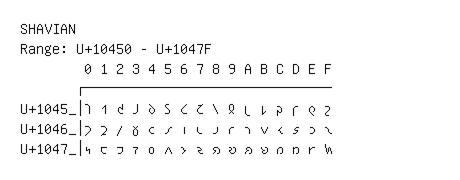

# Shavian

**Range:** `U+10450` - `U+1047F`

[← Back to Index](../README.md)

```text
        0 1 2 3 4 5 6 7 8 9 A B C D E F
       ┌───────────────────────────────
U+1045_│𐑐 𐑑 𐑒 𐑓 𐑔 𐑕 𐑖 𐑗 𐑘 𐑙 𐑚 𐑛 𐑜 𐑝 𐑞 𐑟
U+1046_│𐑠 𐑡 𐑢 𐑣 𐑤 𐑥 𐑦 𐑧 𐑨 𐑩 𐑪 𐑫 𐑬 𐑭 𐑮 𐑯
U+1047_│𐑰 𐑱 𐑲 𐑳 𐑴 𐑵 𐑶 𐑷 𐑸 𐑹 𐑺 𐑻 𐑼 𐑽 𐑾 𐑿
```

## Visual Fallback Reference
If your system lacks the required fonts to render these characters properly, use the image below as a visual guide.


