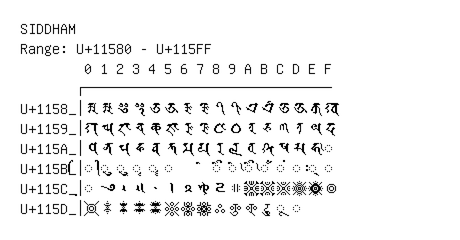

# Siddham

**Range:** `U+11580` - `U+115FF`

[← Back to Index](../README.md)

```text
        0 1 2 3 4 5 6 7 8 9 A B C D E F
       ┌───────────────────────────────
U+1158_│𑖀 𑖁 𑖂 𑖃 𑖄 𑖅 𑖆 𑖇 𑖈 𑖉 𑖊 𑖋 𑖌 𑖍 𑖎 𑖏
U+1159_│𑖐 𑖑 𑖒 𑖓 𑖔 𑖕 𑖖 𑖗 𑖘 𑖙 𑖚 𑖛 𑖜 𑖝 𑖞 𑖟
U+115A_│𑖠 𑖡 𑖢 𑖣 𑖤 𑖥 𑖦 𑖧 𑖨 𑖩 𑖪 𑖫 𑖬 𑖭 𑖮 ◌𑖯
U+115B_│◌𑖰 ◌𑖱 ◌𑖲 ◌𑖳 ◌𑖴 ◌𑖵     ◌𑖸 ◌𑖹 ◌𑖺 ◌𑖻 ◌𑖼 ◌𑖽 ◌𑖾 ◌𑖿
U+115C_│◌𑗀 𑗁 𑗂 𑗃 𑗄 𑗅 𑗆 𑗇 𑗈 𑗉 𑗊 𑗋 𑗌 𑗍 𑗎 𑗏
U+115D_│𑗐 𑗑 𑗒 𑗓 𑗔 𑗕 𑗖 𑗗 𑗘 𑗙 𑗚 𑗛 ◌𑗜 ◌𑗝
```

## Visual Fallback Reference
If your system lacks the required fonts to render these characters properly, use the image below as a visual guide.


