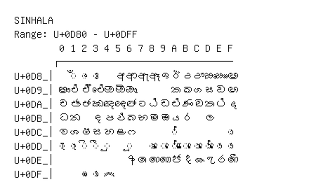

# Sinhala

**Range:** `U+0D80` - `U+0DFF`

[← Back to Index](../README.md)

```text
        0 1 2 3 4 5 6 7 8 9 A B C D E F
       ┌───────────────────────────────
U+0D8_│  ◌ඁ ◌ං ◌ඃ   අ ආ ඇ ඈ ඉ ඊ උ ඌ ඍ ඎ ඏ
U+0D9_│ඐ එ ඒ ඓ ඔ ඕ ඖ       ක ඛ ග ඝ ඞ ඟ
U+0DA_│ච ඡ ජ ඣ ඤ ඥ ඦ ට ඨ ඩ ඪ ණ ඬ ත ථ ද
U+0DB_│ධ න   ඳ ප ඵ බ භ ම ඹ ය ර   ල
U+0DC_│ව ශ ෂ ස හ ළ ෆ       ◌්         ◌ා
U+0DD_│◌ැ ◌ෑ ◌ි ◌ී ◌ු   ◌ූ   ◌ෘ ◌ෙ ◌ේ ◌ෛ ◌ො ◌ෝ ◌ෞ ◌ෟ
U+0DE_│            ෦ ෧ ෨ ෩ ෪ ෫ ෬ ෭ ෮ ෯
U+0DF_│    ◌ෲ ◌ෳ ෴
```

## Visual Fallback Reference
If your system lacks the required fonts to render these characters properly, use the image below as a visual guide.


