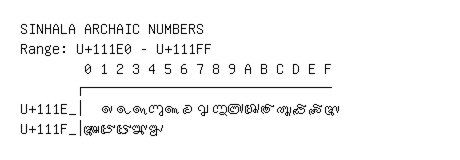

# Sinhala Archaic Numbers

**Range:** `U+111E0` - `U+111FF`

[← Back to Index](../README.md)

```text
        0 1 2 3 4 5 6 7 8 9 A B C D E F
       ┌───────────────────────────────
U+111E_│  𑇡 𑇢 𑇣 𑇤 𑇥 𑇦 𑇧 𑇨 𑇩 𑇪 𑇫 𑇬 𑇭 𑇮 𑇯
U+111F_│𑇰 𑇱 𑇲 𑇳 𑇴
```

## Visual Fallback Reference
If your system lacks the required fonts to render these characters properly, use the image below as a visual guide.


