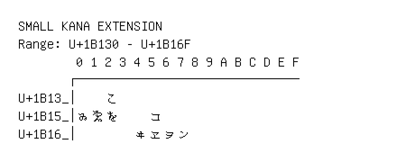

# Small Kana Extension

**Range:** `U+1B130` - `U+1B16F`

[← Back to Index](../README.md)

```text
        0 1 2 3 4 5 6 7 8 9 A B C D E F
       ┌───────────────────────────────
U+1B13_│    𛄲
U+1B15_│𛅐𛅑𛅒    𛅕
U+1B16_│        𛅤𛅥𛅦𛅧
```

## Visual Fallback Reference
If your system lacks the required fonts to render these characters properly, use the image below as a visual guide.


