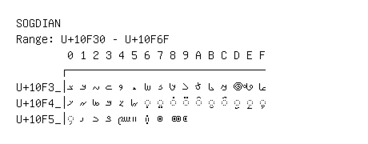

# Sogdian

**Range:** `U+10F30` - `U+10F6F`

[← Back to Index](../README.md)

```text
        0 1 2 3 4 5 6 7 8 9 A B C D E F
       ┌───────────────────────────────
U+10F3_│𐼰 𐼱 𐼲 𐼳 𐼴 𐼵 𐼶 𐼷 𐼸 𐼹 𐼺 𐼻 𐼼 𐼽 𐼾 𐼿
U+10F4_│𐽀 𐽁 𐽂 𐽃 𐽄 𐽅 ◌𐽆 ◌𐽇 ◌𐽈 ◌𐽉 ◌𐽊 ◌𐽋 ◌𐽌 ◌𐽍 ◌𐽎 ◌𐽏
U+10F5_│◌𐽐 𐽑 𐽒 𐽓 𐽔 𐽕 𐽖 𐽗 𐽘 𐽙
```

## Visual Fallback Reference
If your system lacks the required fonts to render these characters properly, use the image below as a visual guide.


