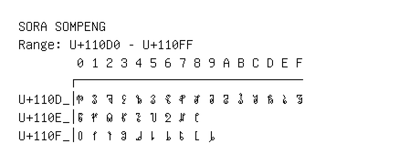

# Sora Sompeng

**Range:** `U+110D0` - `U+110FF`

[← Back to Index](../README.md)

```text
        0 1 2 3 4 5 6 7 8 9 A B C D E F
       ┌───────────────────────────────
U+110D_│𑃐 𑃑 𑃒 𑃓 𑃔 𑃕 𑃖 𑃗 𑃘 𑃙 𑃚 𑃛 𑃜 𑃝 𑃞 𑃟
U+110E_│𑃠 𑃡 𑃢 𑃣 𑃤 𑃥 𑃦 𑃧 𑃨
U+110F_│𑃰 𑃱 𑃲 𑃳 𑃴 𑃵 𑃶 𑃷 𑃸 𑃹
```

## Visual Fallback Reference
If your system lacks the required fonts to render these characters properly, use the image below as a visual guide.


