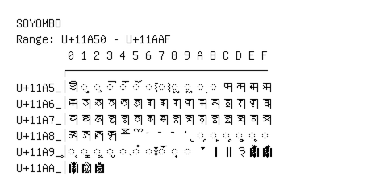

# Soyombo

**Range:** `U+11A50` - `U+11AAF`

[← Back to Index](../README.md)

```text
        0 1 2 3 4 5 6 7 8 9 A B C D E F
       ┌───────────────────────────────
U+11A5_│𑩐 ◌𑩑 ◌𑩒 ◌𑩓 ◌𑩔 ◌𑩕 ◌𑩖 ◌𑩗 ◌𑩘 ◌𑩙 ◌𑩚 ◌𑩛 𑩜 𑩝 𑩞 𑩟
U+11A6_│𑩠 𑩡 𑩢 𑩣 𑩤 𑩥 𑩦 𑩧 𑩨 𑩩 𑩪 𑩫 𑩬 𑩭 𑩮 𑩯
U+11A7_│𑩰 𑩱 𑩲 𑩳 𑩴 𑩵 𑩶 𑩷 𑩸 𑩹 𑩺 𑩻 𑩼 𑩽 𑩾 𑩿
U+11A8_│𑪀 𑪁 𑪂 𑪃 𑪄 𑪅 𑪆 𑪇 𑪈 𑪉 ◌𑪊 ◌𑪋 ◌𑪌 ◌𑪍 ◌𑪎 ◌𑪏
U+11A9_│◌𑪐 ◌𑪑 ◌𑪒 ◌𑪓 ◌𑪔 ◌𑪕 ◌𑪖 ◌𑪗 ◌𑪘 ◌𑪙 𑪚 𑪛 𑪜 𑪝 𑪞 𑪟
U+11AA_│𑪠 𑪡 𑪢
```

## Visual Fallback Reference
If your system lacks the required fonts to render these characters properly, use the image below as a visual guide.


