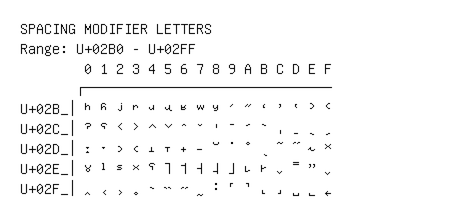

# Spacing Modifier Letters

**Range:** `U+02B0` - `U+02FF`

[← Back to Index](../README.md)

```text
        0 1 2 3 4 5 6 7 8 9 A B C D E F
       ┌───────────────────────────────
U+02B_│ʰ ʱ ʲ ʳ ʴ ʵ ʶ ʷ ʸ ʹ ʺ ʻ ʼ ʽ ʾ ʿ
U+02C_│ˀ ˁ ˂ ˃ ˄ ˅ ˆ ˇ ˈ ˉ ˊ ˋ ˌ ˍ ˎ ˏ
U+02D_│ː ˑ ˒ ˓ ˔ ˕ ˖ ˗ ˘ ˙ ˚ ˛ ˜ ˝ ˞ ˟
U+02E_│ˠ ˡ ˢ ˣ ˤ ˥ ˦ ˧ ˨ ˩ ˪ ˫ ˬ ˭ ˮ ˯
U+02F_│˰ ˱ ˲ ˳ ˴ ˵ ˶ ˷ ˸ ˹ ˺ ˻ ˼ ˽ ˾ ˿
```

## Visual Fallback Reference
If your system lacks the required fonts to render these characters properly, use the image below as a visual guide.


