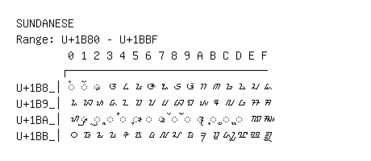

# Sundanese

**Range:** `U+1B80` - `U+1BBF`

[← Back to Index](../README.md)

```text
        0 1 2 3 4 5 6 7 8 9 A B C D E F
       ┌───────────────────────────────
U+1B8_│◌ᮀ ◌ᮁ ◌ᮂ ᮃ ᮄ ᮅ ᮆ ᮇ ᮈ ᮉ ᮊ ᮋ ᮌ ᮍ ᮎ ᮏ
U+1B9_│ᮐ ᮑ ᮒ ᮓ ᮔ ᮕ ᮖ ᮗ ᮘ ᮙ ᮚ ᮛ ᮜ ᮝ ᮞ ᮟ
U+1BA_│ᮠ ◌ᮡ ◌ᮢ ◌ᮣ ◌ᮤ ◌ᮥ ◌ᮦ ◌ᮧ ◌ᮨ ◌ᮩ ◌᮪ ◌᮫ ◌ᮬ ◌ᮭ ᮮ ᮯ
U+1BB_│᮰ ᮱ ᮲ ᮳ ᮴ ᮵ ᮶ ᮷ ᮸ ᮹ ᮺ ᮻ ᮼ ᮽ ᮾ ᮿ
```

## Visual Fallback Reference
If your system lacks the required fonts to render these characters properly, use the image below as a visual guide.


