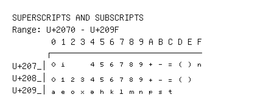

# Superscripts and Subscripts

**Range:** `U+2070` - `U+209F`

[← Back to Index](../README.md)

```text
        0 1 2 3 4 5 6 7 8 9 A B C D E F
       ┌───────────────────────────────
U+207_│⁰ ⁱ     ⁴ ⁵ ⁶ ⁷ ⁸ ⁹ ⁺ ⁻ ⁼ ⁽ ⁾ ⁿ
U+208_│₀ ₁ ₂ ₃ ₄ ₅ ₆ ₇ ₈ ₉ ₊ ₋ ₌ ₍ ₎
U+209_│ₐ ₑ ₒ ₓ ₔ ₕ ₖ ₗ ₘ ₙ ₚ ₛ ₜ
```

## Visual Fallback Reference
If your system lacks the required fonts to render these characters properly, use the image below as a visual guide.


