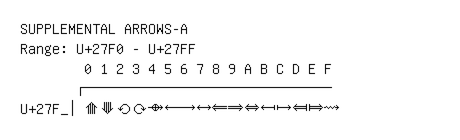

# Supplemental Arrows-A

**Range:** `U+27F0` - `U+27FF`

[← Back to Index](../README.md)

```text
        0 1 2 3 4 5 6 7 8 9 A B C D E F
       ┌───────────────────────────────
U+27F_│⟰ ⟱ ⟲ ⟳ ⟴ ⟵ ⟶ ⟷ ⟸ ⟹ ⟺ ⟻ ⟼ ⟽ ⟾ ⟿
```

## Visual Fallback Reference
If your system lacks the required fonts to render these characters properly, use the image below as a visual guide.


