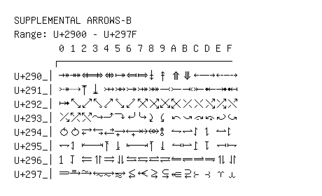

# Supplemental Arrows-B

**Range:** `U+2900` - `U+297F`

[← Back to Index](../README.md)

```text
        0 1 2 3 4 5 6 7 8 9 A B C D E F
       ┌───────────────────────────────
U+290_│⤀ ⤁ ⤂ ⤃ ⤄ ⤅ ⤆ ⤇ ⤈ ⤉ ⤊ ⤋ ⤌ ⤍ ⤎ ⤏
U+291_│⤐ ⤑ ⤒ ⤓ ⤔ ⤕ ⤖ ⤗ ⤘ ⤙ ⤚ ⤛ ⤜ ⤝ ⤞ ⤟
U+292_│⤠ ⤡ ⤢ ⤣ ⤤ ⤥ ⤦ ⤧ ⤨ ⤩ ⤪ ⤫ ⤬ ⤭ ⤮ ⤯
U+293_│⤰ ⤱ ⤲ ⤳ ⤴ ⤵ ⤶ ⤷ ⤸ ⤹ ⤺ ⤻ ⤼ ⤽ ⤾ ⤿
U+294_│⥀ ⥁ ⥂ ⥃ ⥄ ⥅ ⥆ ⥇ ⥈ ⥉ ⥊ ⥋ ⥌ ⥍ ⥎ ⥏
U+295_│⥐ ⥑ ⥒ ⥓ ⥔ ⥕ ⥖ ⥗ ⥘ ⥙ ⥚ ⥛ ⥜ ⥝ ⥞ ⥟
U+296_│⥠ ⥡ ⥢ ⥣ ⥤ ⥥ ⥦ ⥧ ⥨ ⥩ ⥪ ⥫ ⥬ ⥭ ⥮ ⥯
U+297_│⥰ ⥱ ⥲ ⥳ ⥴ ⥵ ⥶ ⥷ ⥸ ⥹ ⥺ ⥻ ⥼ ⥽ ⥾ ⥿
```

## Visual Fallback Reference
If your system lacks the required fonts to render these characters properly, use the image below as a visual guide.


