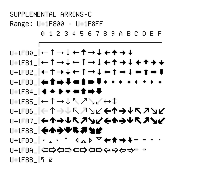

# Supplemental Arrows-C

**Range:** `U+1F800` - `U+1F8FF`

[← Back to Index](../README.md)

```text
        0 1 2 3 4 5 6 7 8 9 A B C D E F
       ┌───────────────────────────────
U+1F80_│🠀 🠁 🠂 🠃 🠄 🠅 🠆 🠇 🠈 🠉 🠊 🠋
U+1F81_│🠐 🠑 🠒 🠓 🠔 🠕 🠖 🠗 🠘 🠙 🠚 🠛 🠜 🠝 🠞 🠟
U+1F82_│🠠 🠡 🠢 🠣 🠤 🠥 🠦 🠧 🠨 🠩 🠪 🠫 🠬 🠭 🠮 🠯
U+1F83_│🠰 🠱 🠲 🠳 🠴 🠵 🠶 🠷 🠸 🠹 🠺 🠻 🠼 🠽 🠾 🠿
U+1F84_│🡀 🡁 🡂 🡃 🡄 🡅 🡆 🡇
U+1F85_│🡐 🡑 🡒 🡓 🡔 🡕 🡖 🡗 🡘 🡙
U+1F86_│🡠 🡡 🡢 🡣 🡤 🡥 🡦 🡧 🡨 🡩 🡪 🡫 🡬 🡭 🡮 🡯
U+1F87_│🡰 🡱 🡲 🡳 🡴 🡵 🡶 🡷 🡸 🡹 🡺 🡻 🡼 🡽 🡾 🡿
U+1F88_│🢀 🢁 🢂 🢃 🢄 🢅 🢆 🢇
U+1F89_│🢐 🢑 🢒 🢓 🢔 🢕 🢖 🢗 🢘 🢙 🢚 🢛 🢜 🢝 🢞 🢟
U+1F8A_│🢠 🢡 🢢 🢣 🢤 🢥 🢦 🢧 🢨 🢩 🢪 🢫 🢬 🢭
U+1F8B_│🢰 🢱
```

## Visual Fallback Reference
If your system lacks the required fonts to render these characters properly, use the image below as a visual guide.


