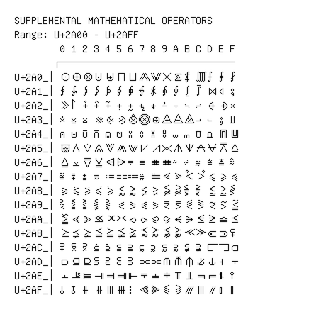

# Supplemental Mathematical Operators

**Range:** `U+2A00` - `U+2AFF`

[← Back to Index](../README.md)

```text
        0 1 2 3 4 5 6 7 8 9 A B C D E F
       ┌───────────────────────────────
U+2A0_│⨀ ⨁ ⨂ ⨃ ⨄ ⨅ ⨆ ⨇ ⨈ ⨉ ⨊ ⨋ ⨌ ⨍ ⨎ ⨏
U+2A1_│⨐ ⨑ ⨒ ⨓ ⨔ ⨕ ⨖ ⨗ ⨘ ⨙ ⨚ ⨛ ⨜ ⨝ ⨞ ⨟
U+2A2_│⨠ ⨡ ⨢ ⨣ ⨤ ⨥ ⨦ ⨧ ⨨ ⨩ ⨪ ⨫ ⨬ ⨭ ⨮ ⨯
U+2A3_│⨰ ⨱ ⨲ ⨳ ⨴ ⨵ ⨶ ⨷ ⨸ ⨹ ⨺ ⨻ ⨼ ⨽ ⨾ ⨿
U+2A4_│⩀ ⩁ ⩂ ⩃ ⩄ ⩅ ⩆ ⩇ ⩈ ⩉ ⩊ ⩋ ⩌ ⩍ ⩎ ⩏
U+2A5_│⩐ ⩑ ⩒ ⩓ ⩔ ⩕ ⩖ ⩗ ⩘ ⩙ ⩚ ⩛ ⩜ ⩝ ⩞ ⩟
U+2A6_│⩠ ⩡ ⩢ ⩣ ⩤ ⩥ ⩦ ⩧ ⩨ ⩩ ⩪ ⩫ ⩬ ⩭ ⩮ ⩯
U+2A7_│⩰ ⩱ ⩲ ⩳ ⩴ ⩵ ⩶ ⩷ ⩸ ⩹ ⩺ ⩻ ⩼ ⩽ ⩾ ⩿
U+2A8_│⪀ ⪁ ⪂ ⪃ ⪄ ⪅ ⪆ ⪇ ⪈ ⪉ ⪊ ⪋ ⪌ ⪍ ⪎ ⪏
U+2A9_│⪐ ⪑ ⪒ ⪓ ⪔ ⪕ ⪖ ⪗ ⪘ ⪙ ⪚ ⪛ ⪜ ⪝ ⪞ ⪟
U+2AA_│⪠ ⪡ ⪢ ⪣ ⪤ ⪥ ⪦ ⪧ ⪨ ⪩ ⪪ ⪫ ⪬ ⪭ ⪮ ⪯
U+2AB_│⪰ ⪱ ⪲ ⪳ ⪴ ⪵ ⪶ ⪷ ⪸ ⪹ ⪺ ⪻ ⪼ ⪽ ⪾ ⪿
U+2AC_│⫀ ⫁ ⫂ ⫃ ⫄ ⫅ ⫆ ⫇ ⫈ ⫉ ⫊ ⫋ ⫌ ⫍ ⫎ ⫏
U+2AD_│⫐ ⫑ ⫒ ⫓ ⫔ ⫕ ⫖ ⫗ ⫘ ⫙ ⫚ ⫛ ⫝̸ ⫝ ⫞ ⫟
U+2AE_│⫠ ⫡ ⫢ ⫣ ⫤ ⫥ ⫦ ⫧ ⫨ ⫩ ⫪ ⫫ ⫬ ⫭ ⫮ ⫯
U+2AF_│⫰ ⫱ ⫲ ⫳ ⫴ ⫵ ⫶ ⫷ ⫸ ⫹ ⫺ ⫻ ⫼ ⫽ ⫾ ⫿
```

## Visual Fallback Reference
If your system lacks the required fonts to render these characters properly, use the image below as a visual guide.


