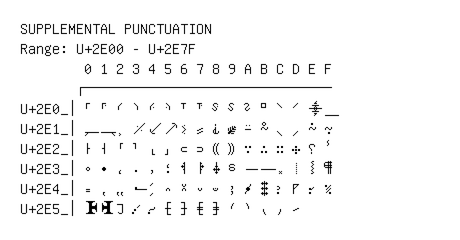

# Supplemental Punctuation

**Range:** `U+2E00` - `U+2E7F`

[← Back to Index](../README.md)

```text
        0 1 2 3 4 5 6 7 8 9 A B C D E F
       ┌───────────────────────────────
U+2E0_│⸀ ⸁ ⸂ ⸃ ⸄ ⸅ ⸆ ⸇ ⸈ ⸉ ⸊ ⸋ ⸌ ⸍ ⸎ ⸏
U+2E1_│⸐ ⸑ ⸒ ⸓ ⸔ ⸕ ⸖ ⸗ ⸘ ⸙ ⸚ ⸛ ⸜ ⸝ ⸞ ⸟
U+2E2_│⸠ ⸡ ⸢ ⸣ ⸤ ⸥ ⸦ ⸧ ⸨ ⸩ ⸪ ⸫ ⸬ ⸭ ⸮ ⸯ
U+2E3_│⸰ ⸱ ⸲ ⸳ ⸴ ⸵ ⸶ ⸷ ⸸ ⸹ ⸺ ⸻ ⸼ ⸽ ⸾ ⸿
U+2E4_│⹀ ⹁ ⹂ ⹃ ⹄ ⹅ ⹆ ⹇ ⹈ ⹉ ⹊ ⹋ ⹌ ⹍ ⹎ ⹏
U+2E5_│⹐ ⹑ ⹒ ⹓ ⹔ ⹕ ⹖ ⹗ ⹘ ⹙ ⹚ ⹛ ⹜ ⹝
```

## Visual Fallback Reference
If your system lacks the required fonts to render these characters properly, use the image below as a visual guide.


