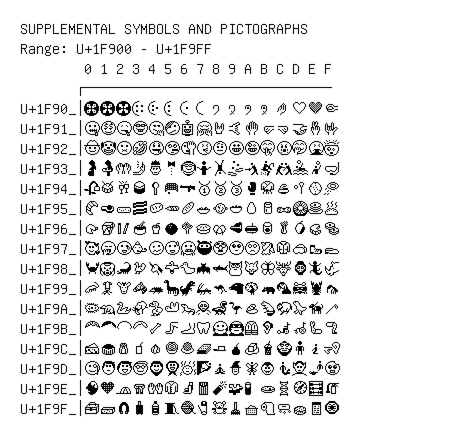

# Supplemental Symbols and Pictographs

**Range:** `U+1F900` - `U+1F9FF`

[← Back to Index](../README.md)

```text
        0 1 2 3 4 5 6 7 8 9 A B C D E F
       ┌───────────────────────────────
U+1F90_│🤀 🤁 🤂 🤃 🤄 🤅 🤆 🤇 🤈 🤉 🤊 🤋 🤌🤍🤎🤏
U+1F91_│🤐🤑🤒🤓🤔🤕🤖🤗🤘🤙🤚🤛🤜🤝🤞🤟
U+1F92_│🤠🤡🤢🤣🤤🤥🤦🤧🤨🤩🤪🤫🤬🤭🤮🤯
U+1F93_│🤰🤱🤲🤳🤴🤵🤶🤷🤸🤹🤺🤻 🤼🤽🤾🤿
U+1F94_│🥀🥁🥂🥃🥄🥅🥆 🥇🥈🥉🥊🥋🥌🥍🥎🥏
U+1F95_│🥐🥑🥒🥓🥔🥕🥖🥗🥘🥙🥚🥛🥜🥝🥞🥟
U+1F96_│🥠🥡🥢🥣🥤🥥🥦🥧🥨🥩🥪🥫🥬🥭🥮🥯
U+1F97_│🥰🥱🥲🥳🥴🥵🥶🥷🥸🥹🥺🥻🥼🥽🥾🥿
U+1F98_│🦀🦁🦂🦃🦄🦅🦆🦇🦈🦉🦊🦋🦌🦍🦎🦏
U+1F99_│🦐🦑🦒🦓🦔🦕🦖🦗🦘🦙🦚🦛🦜🦝🦞🦟
U+1F9A_│🦠🦡🦢🦣🦤🦥🦦🦧🦨🦩🦪🦫🦬🦭🦮🦯
U+1F9B_│🦰🦱🦲🦳🦴🦵🦶🦷🦸🦹🦺🦻🦼🦽🦾🦿
U+1F9C_│🧀🧁🧂🧃🧄🧅🧆🧇🧈🧉🧊🧋🧌🧍🧎🧏
U+1F9D_│🧐🧑🧒🧓🧔🧕🧖🧗🧘🧙🧚🧛🧜🧝🧞🧟
U+1F9E_│🧠🧡🧢🧣🧤🧥🧦🧧🧨🧩🧪🧫🧬🧭🧮🧯
U+1F9F_│🧰🧱🧲🧳🧴🧵🧶🧷🧸🧹🧺🧻🧼🧽🧾🧿
```

## Visual Fallback Reference
If your system lacks the required fonts to render these characters properly, use the image below as a visual guide.


